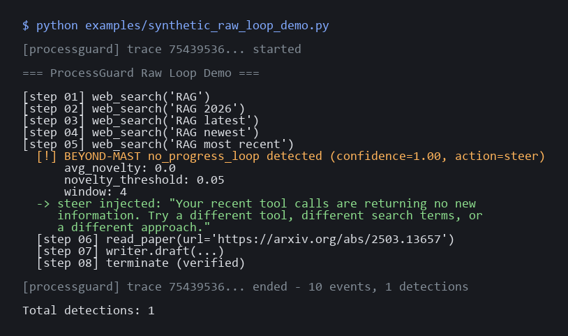

# processguard


<!-- tests-passing badge added once Phase 5 CI workflows land -->

**Runtime detection for the coordination failures that kill 41–87% of multi-agent runs** — mapped to the peer-reviewed MAST taxonomy, fired live as the agent is running, with adapter-level event capture for LangGraph.



*Detectors firing on `examples/synthetic_raw_loop_demo.py` — no LLM required for this one. See `examples/real_langgraph_demo.py` for the non-synthetic Gemini-driven run.*

```bash
pip install git+https://github.com/SahitReddy2/processguard.git#egg=processguard[langgraph]
```

(Not on PyPI yet. v0.1.1 is the first tagged release; install from git until a release is published.)

---

## Why this exists

Your observability stack tells you tokens used and latency. It does not tell you:

- Your researcher agent searched the same query 47 times.
- Your writer agent terminated before reading the researcher's output.
- Your orchestrator said *"I will delegate to agent B"* then called agent A.

These are **coordination failures** — a category of bug that content guardrails (Galileo, NeMo) and observability dashboards (LangSmith, Langfuse) are blind to. They map to a peer-reviewed taxonomy from UC Berkeley: [MAST](https://arxiv.org/abs/2503.13657) (Multi-Agent System Failure Taxonomy), 14 distinct failure modes validated against 1,600+ annotated traces.

ProcessGuard is runtime middleware that flags MAST failure modes **as they happen** so the policy engine can log, steer, halt, or escalate before the loop burns down your token budget.

---

## 60-second demo

Real LangGraph agent, real model (Gemini 2.5 Flash on the free tier — no Anthropic key required), ProcessGuard wired in with one line. The full script is in [`examples/real_langgraph_demo.py`](examples/real_langgraph_demo.py); the abridged version:

```python
import os
from langchain_google_genai import ChatGoogleGenerativeAI
from langchain_core.messages import HumanMessage
from langchain_core.tools import tool
from langgraph.prebuilt import create_react_agent

import processguard
from processguard import PolicyAction

@tool
def web_search(query: str) -> str:
    """Search the web for information on a topic."""
    ...

llm   = ChatGoogleGenerativeAI(model="gemini-2.5-flash", max_output_tokens=1024)
agent = create_react_agent(model=llm, tools=[web_search])

# One line. No SaaS dependency. SQLite by default.
guard = processguard.attach(
    agent,
    default_policy=PolicyAction.LOG,
    llm_detectors=False,        # set True if ANTHROPIC_API_KEY is available
)

agent.invoke(
    {"messages": [HumanMessage(content="Compare RAG, fine-tuning, and prompt engineering …")]},
    config={"recursion_limit": 20},
)

for d in guard.policy.detections:
    print(d.failure_mode, d.failure_name, d.confidence)
```

What ProcessGuard does on every event: routes through the registered detectors, applies the policy (default = log only), and persists the trace to SQLite. The detection log lives at `guard.policy.detections`.

---

## What gets detected

Five detectors in v1, each mapped to a MAST failure mode (or beyond it). Each has a five-sentence contract in its docstring stating what the detector does, when it fires, the smallest case it should catch, a case it must not fire on, and its known limitation. The summary:

| ID          | Detector                       | What it catches                                                       |
|-------------|--------------------------------|-----------------------------------------------------------------------|
| FM-1.3      | Step repetition                | Same tool call with same args, repeated past plausibly-exploratory.   |
| FM-1.5      | Unaware of termination         | Working far longer than the task plausibly requires + narrow actions. |
| FM-2.6      | Reasoning-action mismatch      | Stated intent doesn't match the next action (LLM-judge).              |
| FM-3.1      | Premature termination          | Agent terminated but the output doesn't address the task (LLM-judge). |
| BEYOND-MAST | No-progress tool loop          | Recent tool results introduce no new information.                     |

The two LLM-judge detectors (FM-2.6, FM-3.1) use Anthropic's Haiku for the judgment call. Disable them via `llm_detectors=False` if you don't have an Anthropic key — the other three are pure-Python and free to run.

V2 will add FM-2.3 (task derailment), FM-3.3 (incorrect verification), FM-1.4 (loss of history).

---

## What doesn't work yet

The point of v0.1.1 was an honesty pass over v0.1.0. The following are known gaps and are documented here rather than hidden:

- **CrewAI is deferred to v1.1.** An experimental adapter exists at `processguard.experimental.crewai`, but it was written against the older LangChain-style `step_callback` shape (`.action` / `.observation` attributes) and does not capture tool events from current CrewAI's `TaskOutput`-shaped step output. `processguard.attach(crew)` now raises a clear `TypeError` pointing users at the experimental path. Proper CrewAI support requires hooking `Agent.execute_task` or the BaseTool callback chain — scheduled for v1.1.
- **REASONING events are not auto-emitted by the LangGraph adapter.** LangChain's callback chain has no canonical "reasoning" channel that's consistent across providers (Claude exposes extended thinking; Gemini and most OpenAI models don't). For FM-2.6 (reasoning-action mismatch) to fire on a LangGraph run, users must emit REASONING events themselves via `guard.emit()` from their own LLM-wrapper instrumentation. Without that, FM-2.6 silently has no input to act on.
- **The end-to-end TOOL_CALL/TOOL_RESULT path is unit-tested but not yet validated against a real tool-invoking run.** Item 4's real run used Gemini, which answered from training priors and didn't invoke the wired-in `web_search` tool. A follow-up attempt with a task explicitly outside training distribution produced a different finding: Gemini refused to consult the tool, asserting *"Google I/O 2025 has not happened yet"* on a date that was 2026-05-20. The adapter's callback translation logic is verified by unit tests against the handler directly; whether real LangGraph agents on real models reliably trigger those callbacks remains open.
- **The two LLM-judge detectors have no measured precision or recall.** Their prompts and three plausible failure cases each are audited in [`docs/judge_audit.md`](docs/judge_audit.md). A small evaluation harness is proposed in the same doc; fixture writing and the runner are scheduled for a future session.
- **`pip install processguard` doesn't work yet** because the package isn't published to PyPI. Install from git as shown above.

Two real bugs were discovered by Item 4's run and **fixed** in v0.1.1: the LangGraph adapter was double-tracing every invoke, and the SQLite trace store wasn't visible across threads. Both have regression tests. See [`docs/real_run_findings.md`](docs/real_run_findings.md) for the full discovery story.

---

## Policy: what happens when a detector fires

```python
from processguard import ProcessGuard, PolicyAction, PolicyConfig

guard = ProcessGuard(
    default_policy=PolicyAction.LOG,          # just record (default)
    # default_policy=PolicyAction.STEER,      # inject a corrective message into the run
    # default_policy=PolicyAction.HALT,       # raise ProcessGuardError, stops the agent
    # default_policy=PolicyAction.ESCALATE,   # call your callback with the Detection
)

# Per-failure-mode overrides
guard.policy.policies["FM-1.3"] = PolicyConfig(
    action=PolicyAction.STEER,
    steer_message="You are looping. Try different arguments or a different tool.",
)
guard.policy.policies["FM-3.1"] = PolicyConfig(action=PolicyAction.HALT)

guard.attach(graph)
```

---

## Manual instrumentation (any framework)

For frameworks without an adapter, emit `AgentEvent`s yourself:

```python
from processguard import ProcessGuard
from processguard.core.event import AgentEvent, EventType

guard = ProcessGuard()

guard.emit(AgentEvent(
    trace_id   = "run-001",
    span_id    = "step-1",
    event_type = EventType.TOOL_CALL,
    agent_name = "researcher",
    tool_name  = "web_search",
    tool_args  = {"query": "RAG 2026"},
))
```

This is also how you wire REASONING events for FM-2.6 to fire on a LangGraph run today.

---

## Architecture

```
YOUR AGENT (LangGraph today; CrewAI experimental; raw loop via guard.emit)
        │
   ADAPTER       — normalises events into the OTEL-compatible AgentEvent schema
        │
   DETECTORS     — pure-Python or small LLM calls, one per MAST failure mode
        │
   POLICY ENGINE — log / steer / halt / escalate
        │
   STORAGE       — SQLite (shared-connection, thread-safe). Postgres/Neo4j in v2.
```

---

## Roadmap

- **v0.1.1 (current):** 5 detectors, LangGraph adapter (with the two adapter bugs from Item 4 fixed), SQLite storage, judge-audit doc, real-run findings doc.
- **v1.1:** working CrewAI adapter, evaluation harness for the two LLM-judge detectors (with measured precision/recall on a 20-case fixture set), REASONING-event auto-emission for Claude extended-thinking responses, PyPI release.
- **v2:** four more detectors (FM-2.3 task derailment, FM-3.3 incorrect verification, FM-1.4 loss of history), AutoGen + OpenAI Agents SDK adapters, optional hosted dashboard.
- **Later:** MCP server interface, graph-DB trace storage, auto-tuned thresholds per framework.

---

## Research basis

[Cemri, Pan, Yang et al. — *MAST: Multi-Agent System Failure Taxonomy*](https://arxiv.org/abs/2503.13657) (arXiv 2503.13657). UC Berkeley Sky Lab, 2025. Adopted by IBM Research IT-Bench.

---

## License

MIT.
